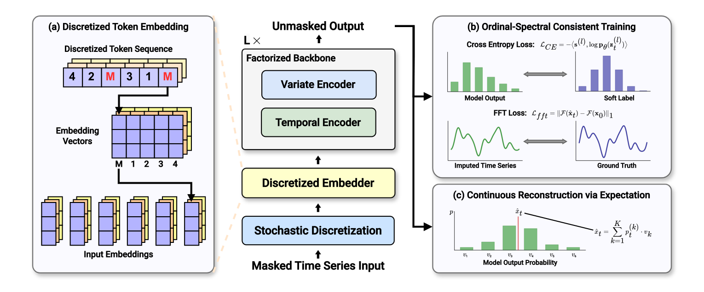
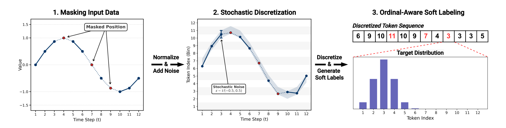
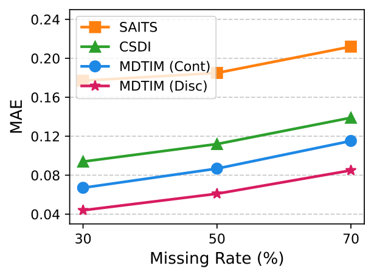
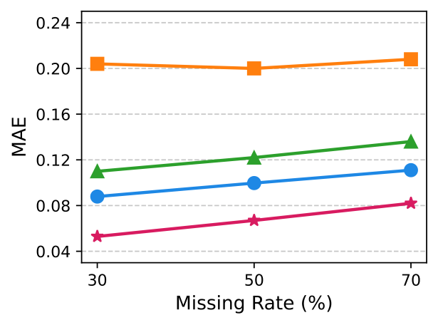
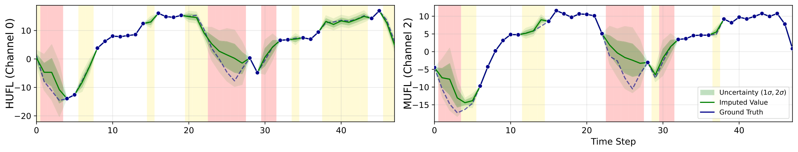

# MDTIM (NeurIPS 2026)

#### This repository is an official PyTorch implementation of MDTIM: [Discretizing Continuous Time Series for Imputation with Masked Diffusion Training](https://openreview.net/forum?id=pKTszDf7fn) [[Project Page](https://dongbeank.github.io/MDTIM)]

## Key Design of MDTIM



#### ⚡ Masked Diffusion Training for Imputation

MDTIM leverages the training paradigm of masked (absorbing-state) discrete diffusion for time series imputation. Missing entries are represented by a `[MASK]` token that is structurally orthogonal to every observed value, so the representation itself separates what is missing from what is observed. The model directly predicts the original values rather than added noise, aligning the learning objective with the imputation task.

#### ⚡ Stochastic Discretization

To bridge the gap between discrete masked diffusion and the continuous, ordinal nature of time series, observed values are normalized, perturbed with bounded uniform noise, and discretized into ordinal tokens. Combined with ordinal-aware soft labels, this preserves continuous dynamics inside a discrete token space.



#### ⚡ Ordinal-Spectral Consistent Training

Training combines an ordinal-aware soft-label cross-entropy with a spectral (FFT) consistency loss, and continuous values are reconstructed as the expectation over the predicted bin distribution — yielding calibrated, probabilistic imputations.

## Imputation Results

MDTIM consistently outperforms state-of-the-art deterministic and generative baselines across missing scenarios, with the margin widening at severe missingness.

<p align="center">


</p>



## Getting Started

### Requirements

1. Install Python 3.11
2. Install the required packages:
```bash
pip install torch --index-url https://download.pytorch.org/whl/cu121
pip install -r requirements.txt
pip install flash-attn --no-build-isolation
```

### Data Preparation

CSV benchmarks (ETTh, Energy, Weather) are included in `./data`. The synthetic Sine dataset is generated automatically on first use (see `Utils/generate_dataset.py`).

### Training

```bash
# Single dataset
python main.py --data etth --mode train

# Or use the provided scripts
bash scripts/train_etth.sh
bash scripts/train_all.sh
```

Checkpoints are versioned under `checkpoints/<dataset>_<window>/v<N>/best.ckpt`. Useful flags (see `config.py` for the full list): `--seed`, `--fft_weight` (0 disables the spectral loss), `--soft_label_window` (0 = one-hot), and `--shared_channel_embedding` (one embedding table shared across all channels, for high-dimensional data).

### Evaluation

```bash
# All datasets, 3 mask seeds, uniform+geometric masks at 30/50/70% missing
python imputation_all.py

# Specific settings
python imputation_all.py --data etth --missing_ratio 0.3 0.5 0.7 --mask_type uniform

# Also report CRPS (probabilistic calibration)
python imputation_all.py --data etth energy sine --crps
```

Results are written to `imputation_results/all_results.csv` (per-seed) and `stats_all.csv` (mean ± std over mask seeds). MAE/MSE/RMSE are computed on missing positions only; CSV benchmarks are standardized with train-split statistics.

## Citation
If you find this repo useful for your research, please cite our paper:
```bibtex
@inproceedings{kim2026discretizing,
  title={Discretizing Continuous Time Series for Imputation with Masked Diffusion Training},
  author={Kim, Dongbin and Lee, Seungyun and Shin, Geonwoo and Lee, Jaewook},
  booktitle={Advances in Neural Information Processing Systems},
  volume={39},
  year={2026}
}
```

## Acknowledgements
We would like to express our appreciation for the following GitHub repositories, which provided valuable code bases:

- [MDLM](https://github.com/kuleshov-group/mdlm)

## Contact
If you have any questions or want to use the code, please contact dongbin413@snu.ac.kr
